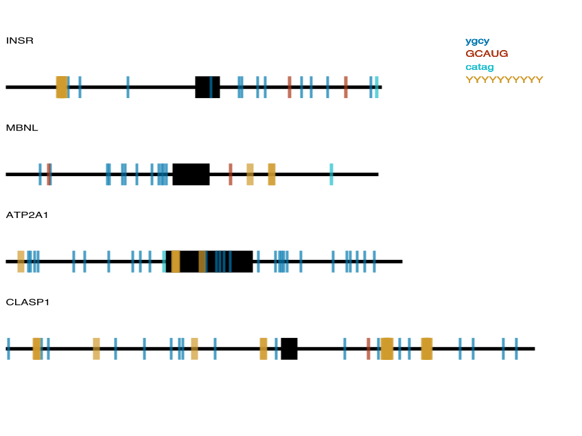

## Motif Marking Tool (Jason's OOP Version)
Cameron Watson

### Description

*motifMark.py* is a tool for visualizing the location of short motifs in a fragment of gene or transcript. The program takes a FASTA file as input, with exons capitalized and introns in lower-case (see **Example Input**). Additionally, a file containing unique motifs to search for is also required, with one motif per line. Motifs can include IUPAC degenerate bases. This program will return all possible hits to each motif. The output is a graphic visualization (.svg) of each input sequence, with the introns, exons, and various motifs all denoted (see **Example Output**). 

### Usage

*motifMark.py* requires the following Python modules:

 - argparse
 - re
 - pycario
 - numpy

The program can be called from the command-line with two flags for the input files:

| Flag | Verbose flag | Argument |
| :---: | :---: | :---: |
| -f | --fasta | input fasta file |
| -m | --motif | input motif file |

Example:

```
./motifMark.py -f input.fasta -m motifs.txt
```

### Example Input

FASTA records with capitalization denoting exons (see *inputs/Figure_1.fasta*):

```
>MBNL chr3:152446461-152447003 
tgtaattaactacaaagaggagttatcctcccaataacaactcagtagtgcctttattgt
gcatgcttagtcttgttattcgttgtatatggcattccgatgatttgtttttttatttgt
tttttctcacctacccaaaaatgcactgctgcccccatgatgcacctctgcttgctgttt
atgttaatgcgcttgaaccccactggcccattgccatcatgtgctcgctgcctgctaatt
aagACTCAGTCGGCTGTCAAATCACTGAAGCGACCCCTCGAGGCAACCTTTGACCTGgta
ctatgacctttcaccttttagcttggcatgtagctttattgtagatacaagttttttttt
taaatcaactttaaaatatatatccttttttctgttatagagttgtaaagtacaatgaaa
aaactgagtgtggtttcctgacaaaattagtagaaagactataatctaagtacatagatg
gatatcatacaataaaagattctgaaagcccagcagcccacattcagtttaactacattg
tag

```

Motifs with degenerate bases in one column (see *inputs/Fig_1_motifs.txt*):

```
ygcy
GCAUG
catag
YYYYYYYYYY
```

### Example Output

The output figure will be saved to the working directory under the same name as the input FASTA file.

